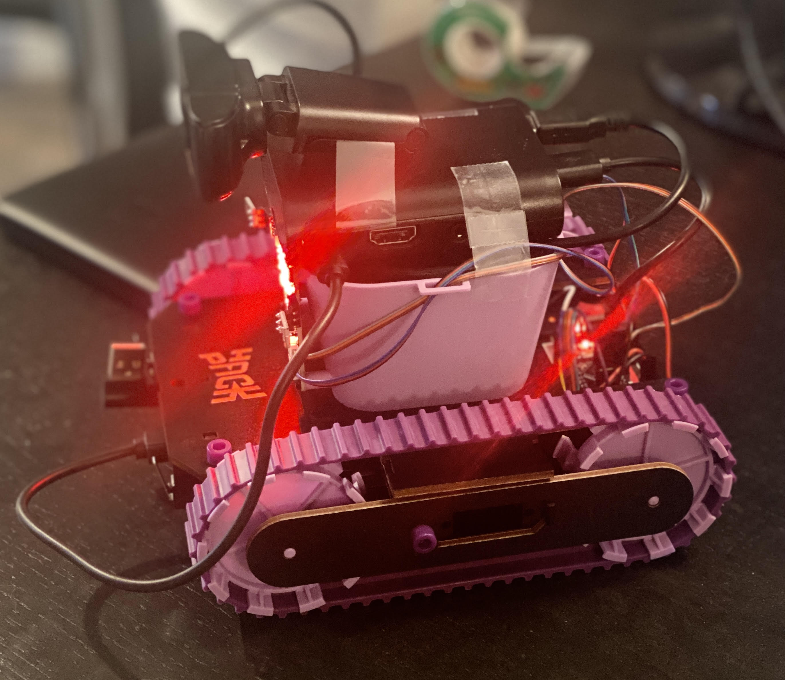
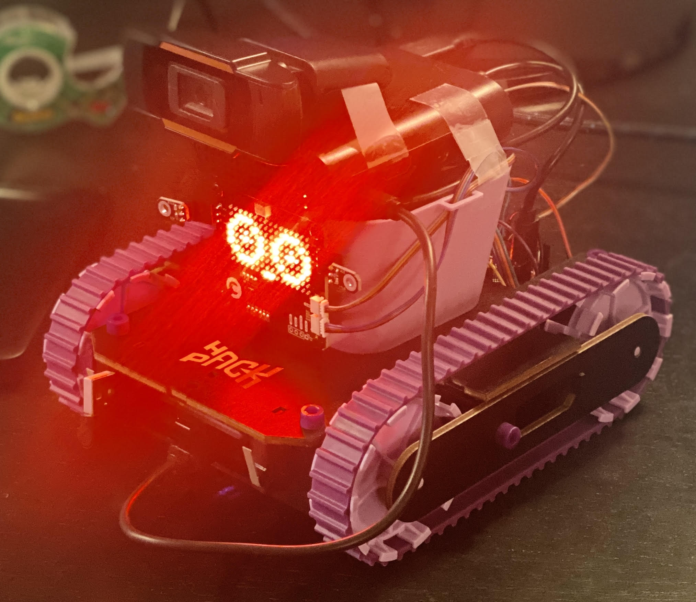
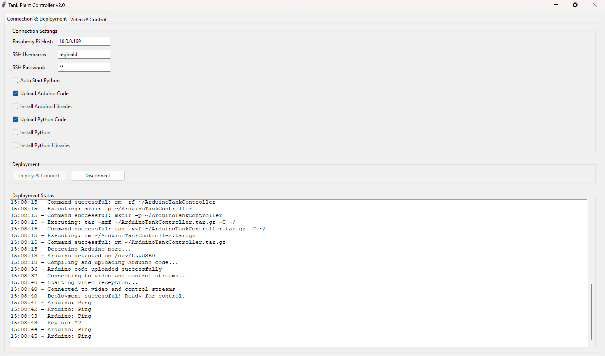
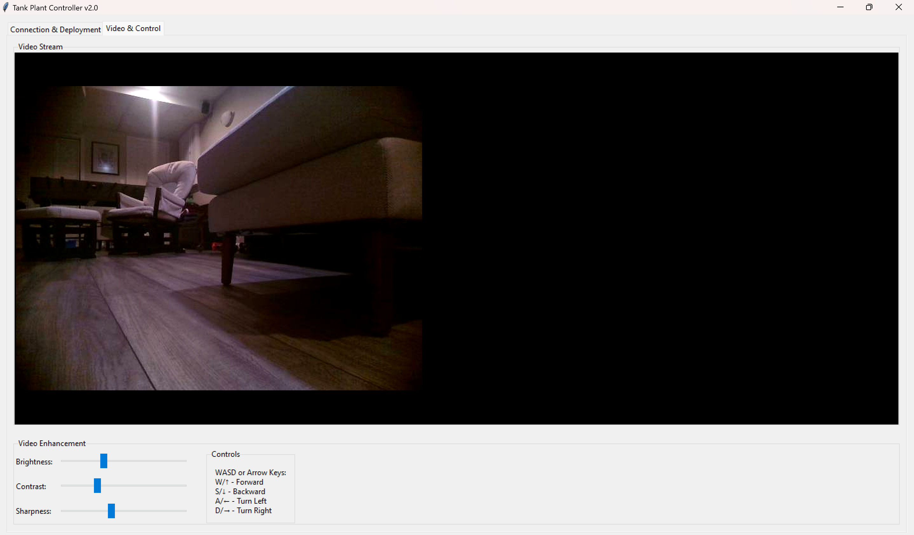

# Pi Remote Tank

Img 1 | Img 2
:-------------------------:|:-------------------------:
  |  
  |  

---

This is a modification of the `Tank Plant` Hack Pack box (#008), designed to use a webcam and be controlled from your keyboard.

This project expects you have the following:
1. A **Raspberry Pi** (or other device running a debian-based distro), as the **host device**. I chose to use a Raspberry Pi 4B. This device must be:
    1. Running headless.
    2. Allowing ssh login.
2. Your device can be powered via some sort of **battery pack**. I found that the CrunchLabs batteries that provide `5V, 3A` are enough. Your results may vary. I recommend running `vcgencmd get_throttled` on the host device to make sure your device is getting enough power. If you see `0x50005`, this is bad, and means your device is currently throttling. If you see `0x50000`, this means your device previously throttled, but it's probably fine - proceed at your own risk.
3. **Webcam**. Anything that can be used by your host device.

It also assumes:
1. You know how to install python.
2. You know how to run python files.
3. You have installed python on your computer.
4. You have installed the following libraries on your computer: `opencv-python numpy pillow paramiko scp`

 ---

## Wiring + Placement

The Tank Plant must be wired as the instructions show. Connect the webcam to the host device. Connect the Arduino to the host device using a data-capable cable, ideally a CrunchLabs one.

Mount your battery, camera, and host device on the tank however you see fit. I chose to put the Pi over the plant holder, tape the webcam onto it, and use the default battery so no need to mount that.

## Firmware

Download the source code from the [Releases on github](https://github.com/Reginald-Gillespie/PiRemoteTank/releases). Unzip it. You **ONLY** need to run `main.py`. 

*No code needs to go on the pi*. 

*No Code needs to go on the arduino*.

When `main.py` runs, provide it your ssh credentials, along with the IP address of your pi. It will login, upload code to the pi and the arduino, start the server and connect.

---

If the code fails to automatically upload, `ArduinoTankController` contains the arduino project that goes on the Tank Plant. `stream.py` should be running on the host device. To manually connect, start `main.py`, uncheck all options, and hit connect. 

